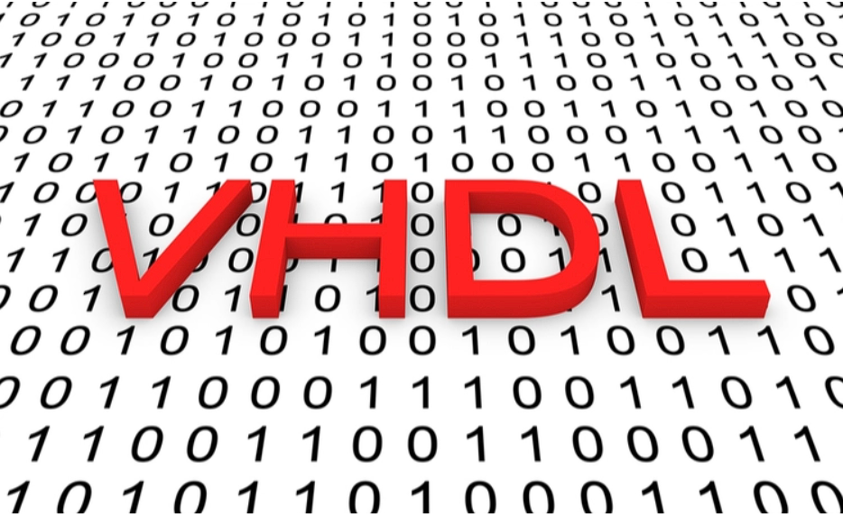
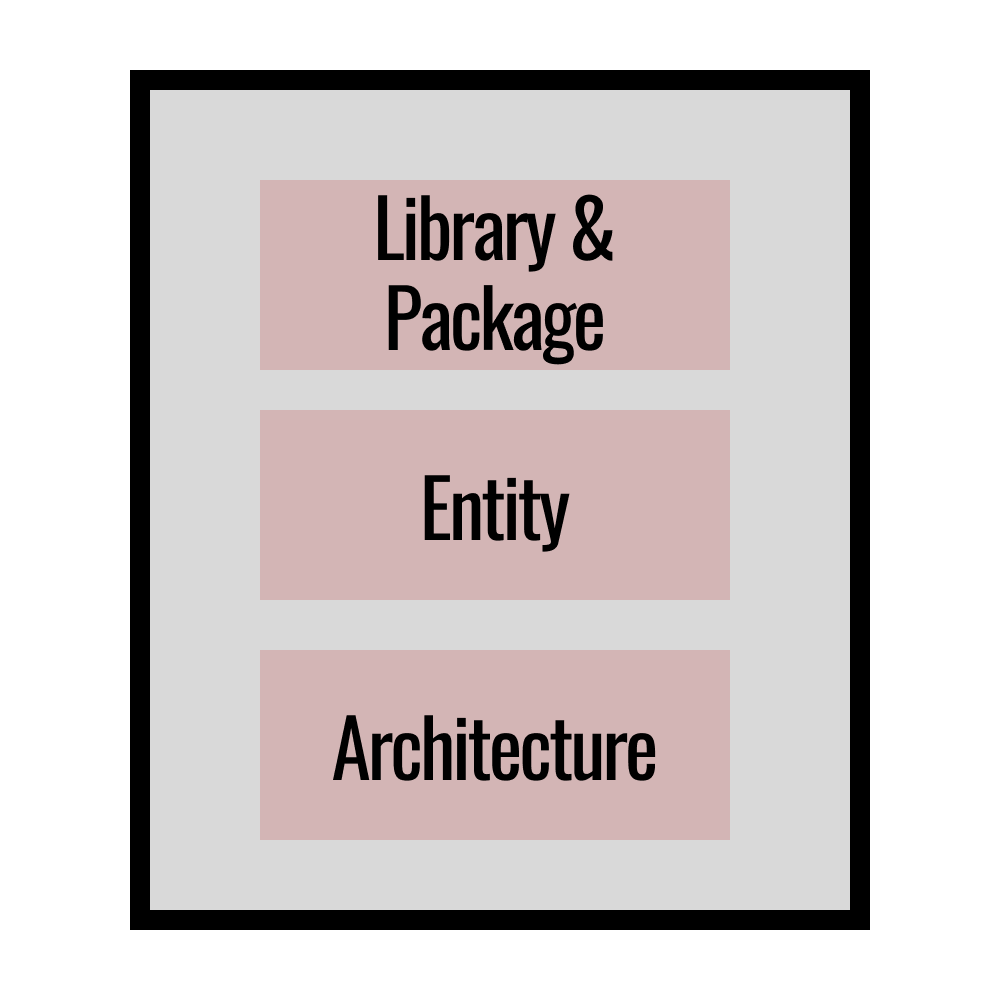
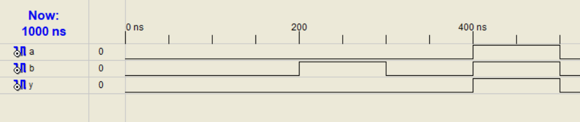
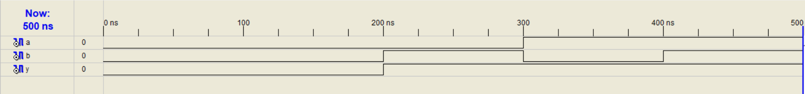
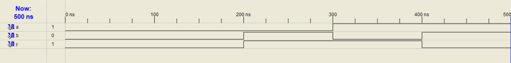

# VHDL
VHDL stands for **V**HSIC **H**ardware **D**escription **L**anguage.

VHSIC stands for **V**ery **H**igh **S**peed **I**ntegrated **C**ircuits.

VHDL is a programming language used for describing the behavior and structure of electronic systems. VHDL is widely used in the design, simulation, and verification of digital circuits, including field-programmable gate arrays (FPGAs) and application-specific integrated circuits (ASICs).



# WHY VHDL?
VHDL has the following advantages:-

+ It is industry standard and is IEEE Standard Language.
+ It is platform/vendor independent.
+It can be used to design and simulate digital circuits.
+ It supports hierarchical design
+ It is case insensitive
+ It is a concurrent language i.e. all lines of code execute at the same time. However, it also supports sequential statements.
+ Quick turn around time to market.

# How to write code in VHDL?

VHDL supports the follwing coding conventions:-
+ **DATAFLOW STYLE:-** Here, the code is written in a concurrent style where data flows from input to output after performing the necessary logical operations between input and output.
+ **BEHAVIORAL STYLE:-** Here, the code is written in hierarchical manner under processed statements and it describes the behaviour of the circuit with respect to it's truth table.
+ **STRUCTURAL STYLE:-** The code is written in hierarchical manner and different components of the circuit are described at first then they are reconnected to form the original larger circuit.
+ **MIXED STYLE:-** It is a combination of the above three styles.

# Components of VHDL code

<p align="center">
  
</p>

Components of VHDL code include the following:-
+ **Library & Package:-** It contains all essential logic and operations to develop the vhdl codes for example, addition, subtraction etc.
+ **Entity:-** It contains all input and output variables used in vhdl code.
+ **Architecture:-** It is the main body of of code where the user types the code to design the circuit.

# VHDL Codes

### Dataflow Style

+ Logical AND

**CODE:**
```vhdl
library IEEE;
use IEEE.STD_LOGIC_1164.ALL;
use IEEE.STD_LOGIC_ARITH.ALL;
use IEEE.STD_LOGIC_UNSIGNED.ALL;

entity andgate is
    Port ( a : in  STD_LOGIC;
           b : in  STD_LOGIC;
           y : out  STD_LOGIC);
end andgate;

architecture Behavioral of andgate is

begin

y <= a and b;

end Behavioral;
```

<!-- <p align="center">
  
</p> -->
<br><br>
+ Logical OR

**CODE:**
```vhdl
library IEEE;
use IEEE.STD_LOGIC_1164.ALL;
use IEEE.STD_LOGIC_ARITH.ALL;
use IEEE.STD_LOGIC_UNSIGNED.ALL;

entity orgate is
    Port ( a : in  STD_LOGIC;
           b : in  STD_LOGIC;
           y : out  STD_LOGIC);
end orgate;

architecture Behavioral of orgate is

begin

y <= a or b;

end Behavioral;
```

<!-- <p align="center">
  
</p> -->
<br><br>

+ Logical XOR

**CODE:**
```vhdl
library IEEE;
use IEEE.STD_LOGIC_1164.ALL;
use IEEE.STD_LOGIC_ARITH.ALL;
use IEEE.STD_LOGIC_UNSIGNED.ALL;

entity xorgate is
    Port ( a : in  STD_LOGIC;
           b : in  STD_LOGIC;
           y : out  STD_LOGIC);
end xorgate;

architecture Behavioral of xorgate is

begin

y <= a xor b;

end Behavioral;
```

<!-- <p align="center">
  
</p> -->
<br><br>
+ Half Adder

**CODE:**
```vhdl
library IEEE;
use IEEE.STD_LOGIC_1164.ALL;
use IEEE.STD_LOGIC_ARITH.ALL;
use IEEE.STD_LOGIC_UNSIGNED.ALL;

entity halfadder is
    Port ( a : in  STD_LOGIC;
           b : in  STD_LOGIC;
           s : out  STD_LOGIC;
           cout : out  STD_LOGIC);
end halfadder;

architecture Behavioral of halfadder is

begin

s <= a xor b;
cout <= a and b;

end Behavioral;
```

<!-- <p align="center">
  
</p> -->
<br><br>
+ Half Subtractor

**CODE:**
```vhdl
library IEEE;
use IEEE.STD_LOGIC_1164.ALL;
use IEEE.STD_LOGIC_ARITH.ALL;
use IEEE.STD_LOGIC_UNSIGNED.ALL;

entity halfsubtractor is
    Port ( a : in  STD_LOGIC;
           b : in  STD_LOGIC;
           d : out  STD_LOGIC;
           bout : out  STD_LOGIC);
end halfsubtractor;

architecture Behavioral of halfsubtractor is

begin

d <= a xor b;
bout <= (not a) and b;

end Behavioral;
```

<!-- <p align="center">
  
</p> -->
<br><br>
+ Full Adder

**CODE:**
```vhdl
library IEEE;
use IEEE.STD_LOGIC_1164.ALL;
use IEEE.STD_LOGIC_ARITH.ALL;
use IEEE.STD_LOGIC_UNSIGNED.ALL;

entity fulladder is
    Port ( a : in  STD_LOGIC_VECTOR(2 downto 0);
           y : out  STD_LOGIC_VECTOR(1 downto 0));
end fulladder;

architecture Behavioral of fulladder is

begin

y(1) <= a(2) xor a(1) xor a(0);
y(0) <= (a(2) and a(1)) or ((a(2) xor a(1)) and a(0));

end Behavioral;
```

<!-- <p align="center">
  
</p> -->
<br><br>
+ Full Subtractor

**CODE:**
```vhdl
library IEEE;
use IEEE.STD_LOGIC_1164.ALL;
use IEEE.STD_LOGIC_ARITH.ALL;
use IEEE.STD_LOGIC_UNSIGNED.ALL;

entity fullsubtractor is
    Port ( a : in  STD_LOGIC_VECTOR(2 downto 0);
           y : out  STD_LOGIC_VECTOR(1 downto 0));
end fullsubtractor;

architecture Behavioral of fullsubtractor is

begin

y(1) <= a(2) xor a(1) xor a(0);
y(0) <= (a(2) and a(1)) or ((a(2) xor a(1)) and a(0));

end Behavioral;
```

<!-- <p align="center">
  
</p> -->
<br><br>
+ 2 X 1 Multiplexer

**CODE:**
```vhdl
library IEEE;
use IEEE.STD_LOGIC_1164.ALL;
use IEEE.STD_LOGIC_ARITH.ALL;
use IEEE.STD_LOGIC_UNSIGNED.ALL;

entity mux is
    Port ( a : in  STD_LOGIC_VECTOR (1 downto 0);
           s : in  STD_LOGIC;
           o : out  STD_LOGIC);
end mux;

architecture Behavioral of mux is

begin

o <= ((not s) and a(0))or(s and a(1));

end Behavioral;
```

<!-- <p align="center">
  
</p> -->
<br><br>
+ 4 X 1 Multiplexer

**CODE:**
```vhdl
library IEEE;
use IEEE.STD_LOGIC_1164.ALL;
use IEEE.STD_LOGIC_ARITH.ALL;
use IEEE.STD_LOGIC_UNSIGNED.ALL;

entity mux is
    Port ( a : in  STD_LOGIC_VECTOR (3 downto 0);
           s : in  STD_LOGIC_VECTOR(1 downto 0);
           o : out  STD_LOGIC);
end mux;

architecture Behavioral of mux is

begin

o <= ((not s(0)) and (not s(1)) and a(0)) or 
((not s(0)) and s(1) and a(1)) or 
((not s(0)) and (not s(1)) and a(2)) or
(s(0) and s(1) and a(3));

end Behavioral;
```

<!-- <p align="center">
  
</p> -->
<br><br>
+ 2 : 4 Decoder

**CODE:**
```vhdl
library IEEE;
use IEEE.STD_LOGIC_1164.ALL;
use IEEE.STD_LOGIC_ARITH.ALL;
use IEEE.STD_LOGIC_UNSIGNED.ALL;

entity decoder is
    Port ( a : in  STD_LOGIC_VECTOR (1 downto 0);
           o : out  STD_LOGIC_VECTOR (3 downto 0));
end decoder;

architecture Behavioral of decoder is

begin

o(0) <= ((not a(0)) and (not a(1)));
o(1) <= ((not a(0)) and a(1));
o(2) <= (a(0) and (not a(1)));
o(3) <= (a(0) and a(1));

end Behavioral;

```

<!-- <p align="center">
  
</p> -->
<br><br>
+ 3 : 8 Decoder

**CODE:**
```vhdl
library IEEE;
use IEEE.STD_LOGIC_1164.ALL;
use IEEE.STD_LOGIC_ARITH.ALL;
use IEEE.STD_LOGIC_UNSIGNED.ALL;

entity decoder is
    Port ( a : in  STD_LOGIC_VECTOR (2 downto 0);
           o : out  STD_LOGIC_VECTOR (7 downto 0));
end decoder;

architecture Behavioral of decoder is

begin

o(0) <= ((not a(0)) and (not a(1)) and (not a(2)));
o(1) <= ((not a(0)) and (not a(1)) and a(2));
o(2) <= ((not a(0)) and a(1) and (not a(2)));
o(3) <= ((not a(0)) and a(1) and a(2));
o(4) <= (a(0) and (not a(1)) and (not a(2)));
o(5) <= (a(0) and (not a(1)) and a(2));
o(6) <= (a(0) and a(1) and (not a(2)));
o(7) <= (a(0) and a(1) and a(2));

end Behavioral;

```

<!-- <p align="center">
  
</p> -->

### Behavioral Style
+ Logical AND gate

**CODE:**
```vhdl
library IEEE;
use IEEE.STD_LOGIC_1164.ALL;
use IEEE.STD_LOGIC_ARITH.ALL;
use IEEE.STD_LOGIC_UNSIGNED.ALL;

entity andgate is
    Port ( a : in  STD_LOGIC;
           b : in  STD_LOGIC;
           y : out  STD_LOGIC);
end andgate;

architecture Behavioral of andgate is

begin
	process(a,b)
	variable temp:STD_LOGIC:='0';
		begin
			if(a = '1' and b= '1')then
				temp := '1';
			else
				temp := '0';
		end if;
		y <= temp;
	end process;
end Behavioral;

```

<!-- <p align="center">
  
</p> -->
<br><br>
+ Logical OR gate

**CODE:**
```vhdl
library IEEE;
use IEEE.STD_LOGIC_1164.ALL;
use IEEE.STD_LOGIC_ARITH.ALL;
use IEEE.STD_LOGIC_UNSIGNED.ALL;

entity orgate is
    Port ( a : in  STD_LOGIC;
           b : in  STD_LOGIC;
           y : out  STD_LOGIC);
end orgate;

architecture Behavioral of orgate is

begin
	process(a,b)
	variable temp:STD_LOGIC:='0';
		begin
			if(a = '0' and b= '0')then
				temp := '0';
			else
				temp := '1';
		end if;
		y <= temp;
	end process;
end Behavioral;

```

<!-- <p align="center">
  
</p> -->
<br><br>
+ Logical XOR gate

**CODE:**
```vhdl
library IEEE;
use IEEE.STD_LOGIC_1164.ALL;
use IEEE.STD_LOGIC_ARITH.ALL;
use IEEE.STD_LOGIC_UNSIGNED.ALL;

entity xorgate is
    Port ( a : in  STD_LOGIC;
           b : in  STD_LOGIC;
           y : out  STD_LOGIC);
end xorgate;

architecture Behavioral of xorgate is

begin
	process(a,b)
	variable temp:STD_LOGIC:='0';
		begin
			if(a = b)then
				temp := '0';
			else
				temp := '1';
		end if;
		y <= temp;
	end process;
end Behavioral;

```

<!-- <p align="center">
  
</p> -->
<br><br>
+ 4 X 1 Multiplexer

**CODE:**
```vhdl
library IEEE;
use IEEE.STD_LOGIC_1164.ALL;
use IEEE.STD_LOGIC_ARITH.ALL;
use IEEE.STD_LOGIC_UNSIGNED.ALL;

entity multiplexer is
    Port ( i : in  STD_LOGIC_VECTOR(3 downto 0);
           s : in  STD_LOGIC_VECTOR(1 downto 0);
           y : out  STD_LOGIC);
end multiplexer;

architecture Behavioral of multiplexer is

begin
	process(s,i)
	variable temp:STD_LOGIC:='0';
		begin
			if(s = "00")then
				y <= i(0);
            elsif(s = "01")then
				y <= i(1);
            elsif(s = "10")then
				y <= i(2);
			else
				y <= i(3);
		end if;
	end process;
end Behavioral;

```

<!-- <p align="center">
  
</p> -->
<br><br>
+ 1 X 8 Demultiplexer

**CODE:**
```vhdl
library IEEE;
use IEEE.STD_LOGIC_1164.ALL;
use IEEE.STD_LOGIC_ARITH.ALL;
use IEEE.STD_LOGIC_UNSIGNED.ALL;

entity demultiplexer is
    Port ( a : in  STD_LOGIC;
           s : in  STD_LOGIC_VECTOR (2 downto 0);
           y : out  STD_LOGIC_VECTOR (7 downto 0));
end demultiplexer;

architecture Behavioral of demultiplexer is

begin
	process(a,s)
	begin
		if(a='1')then
			if(s="000")then
				y<="00000001";
			elsif(s="001")then
				y<="00000010";
			elsif(s="010")then
				y<="00000100";
			elsif(s="011")then
				y<="00001000";
			elsif(s="100")then
				y<="00010000";
			elsif(s="101")then
				y<="00100000";
			elsif(s="110")then
				y<="01000000";
			else
				y<="10000000";
			end if;
		else
			y<="00000000";
		end if;
	end process;
end Behavioral;


```

<!-- <p align="center">
  
</p> -->
<br><br>
+ 3 : 8 decoder

**CODE:**
```vhdl
library IEEE;
use IEEE.STD_LOGIC_1164.ALL;
use IEEE.STD_LOGIC_ARITH.ALL;
use IEEE.STD_LOGIC_UNSIGNED.ALL;

entity decoder is
    Port ( i : in  STD_LOGIC_VECTOR(3 downto 0);
           y : out  STD_LOGIC_VECTOR(1 downto 0));
end decoder;

architecture Behavioral of decoder is

begin
	process(i)
	variable temp:STD_LOGIC:='0';
		begin
			if(i = "000")then
				y <= "00000001";
            if(i = "001")then
				y <= "00000010";
            if(i = "010")then
				y <= "00000100";
            if(i = "011")then
				y <= "00001000";
            if(i = "100")then
				y <= "00010000";
            if(i = "101")then
				y <= "00100000";
            if(i = "110")then
				y <= "01000000";
			else
				y <= "10000000";
		end if;
	end process;
end Behavioral;

```

<!-- <p align="center">
  
</p> -->
<br><br>
+ SR FLip Flop

**CODE:**
```vhdl
library IEEE;
use IEEE.STD_LOGIC_1164.ALL;
use IEEE.STD_LOGIC_ARITH.ALL;
use IEEE.STD_LOGIC_UNSIGNED.ALL;

entity srflipflop is
    Port ( CLK : in  STD_LOGIC;
           S : in  STD_LOGIC;
           R : in  STD_LOGIC;
           Q : out  STD_LOGIC;
           QB : out  STD_LOGIC);
end srflipflop;

architecture Behavioral of srflipflop is

begin
process(CLK)
variable temp:std_logic:='0';
begin
	if(CLK = '1' and CLK'event)then
		if(S='0' and R='0')then
			temp:=temp;
		elsif(J='0' and K='1')then
			temp:='0';
		elsif(J='1' and K='0')then
			temp:='1';
		else
			temp:='Z';
		end if;
	end if;
	Q<=temp;
	QB<=not(temp);
end process;
end Behavioral;

```

<!-- <p align="center">
  
</p> -->
<br><br>
+ JK FLip Flop

**CODE:**
```vhdl
library IEEE;
use IEEE.STD_LOGIC_1164.ALL;
use IEEE.STD_LOGIC_ARITH.ALL;
use IEEE.STD_LOGIC_UNSIGNED.ALL;

entity jkflipflop is
    Port ( CLK : in  STD_LOGIC;
           S : in  STD_LOGIC;
           R : in  STD_LOGIC;
           Q : out  STD_LOGIC;
           QB : out  STD_LOGIC);
end jkflipflop;

architecture Behavioral of jkflipflop is

begin
process(CLK)
variable temp:std_logic:='0';
begin
	if(CLK = '1' and CLK'event)then
		if(S='0' and R='0')then
			temp:=temp;
		elsif(J='0' and K='1')then
			temp:='0';
		elsif(J='1' and K='0')then
			temp:='1';
		else
			temp:=not(temp);
		end if;
	end if;
	Q<=temp;
	QB<=not(temp);
end process;
end Behavioral;

```

<!-- <p align="center">
  
</p> -->
<br><br>
+ D FLip Flop

**CODE:**
```vhdl
library IEEE;
use IEEE.STD_LOGIC_1164.ALL;
use IEEE.STD_LOGIC_ARITH.ALL;
use IEEE.STD_LOGIC_UNSIGNED.ALL;

entity dflipflop is
    Port ( CLK : in  STD_LOGIC;
           D : in  STD_LOGIC;
           Q : out  STD_LOGIC;
           QB : out  STD_LOGIC);
end dflipflop;

architecture Behavioral of dflipflopF is

begin
process(CLK)
variable temp:std_logic:='0';
begin
	if(CLK = '1' and CLK'event)then
		if(D='0')then
			temp:='0';
		elsif(D='1')then
			temp:='1';
		else
			temp:='Z';
		end if;
	end if;
	Q<=temp;
	QB<=not(temp);
end process;
end Behavioral;

```

<!-- <p align="center">
  
</p> -->
<br><br>
+ T FLip Flop

**CODE:**
```vhdl
library IEEE;
use IEEE.STD_LOGIC_1164.ALL;
use IEEE.STD_LOGIC_ARITH.ALL;
use IEEE.STD_LOGIC_UNSIGNED.ALL;

entity tflipflop is
    Port ( CLK : in  STD_LOGIC;
           T : in  STD_LOGIC;
           Q : out  STD_LOGIC;
           QB : out  STD_LOGIC);
end tflipflop;

architecture Behavioral of tflipflopF is

begin
process(CLK)
variable temp:std_logic:='0';
begin
	if(CLK = '1' and CLK'event)then
		if(T='0')then
			temp:=temp;
		elsif(T='1')then
			temp:=not(temp);
		else
			temp:='Z';
		end if;
	end if;
	Q<=temp;
	QB<=not(temp);
end process;
end Behavioral;

```

<!-- <p align="center">
  
</p> -->
<br><br>
+ 4 bit ALU

**CODE:**
```vhdl
library IEEE;
use IEEE.STD_LOGIC_1164.ALL;
use IEEE.NUMERIC_STD.ALL;


---- Uncomment the following library declaration if instantiating
---- any Xilinx primitives in this code.
--library UNISIM;
--use UNISIM.VComponents.all;

entity fourbitALU is
    Port ( inp_a : in  SIGNED (3 downto 0);
           inp_b : in  SIGNED (3 downto 0);
           sel : in  STD_LOGIC_VECTOR (2 downto 0);
           out_alu : out  SIGNED(3 downto 0));
end fourbitALU;

architecture Behavioral of fourbitALU is

begin
process(inp_a,inp_b,sel)
begin
	case sel is
		when "000" =>
			out_alu<= inp_a + inp_b;
	
		when "001" =>
			out_alu<= inp_a - inp_b;

		when "010" =>
			out_alu<= inp_a - 1;

		when "011" =>
			out_alu<= inp_a + 1;

		when "100" =>
			out_alu<= inp_a and inp_b;

		when "101" =>
			out_alu<= inp_a or inp_b;
	
		when "110" =>
			out_alu<= not(inp_a);

		when "111" =>
			out_alu<= inp_a xor inp_b;
	
		when others =>
			NULL;
	end case;
end process;

end Behavioral;

```

<!-- <p align="center">
  
</p> -->

### Structural Style
+ 8 bit Parallel Adder

**CODE:**
```vhdl
library IEEE;
use IEEE.STD_LOGIC_1164.ALL;
use IEEE.STD_LOGIC_ARITH.ALL;
use IEEE.STD_LOGIC_UNSIGNED.ALL;

entity paralleleightbit is
    Port ( a : in  STD_LOGIC_VECTOR (7 downto 0);
           b : in  STD_LOGIC_VECTOR (7 downto 0);
           cin : in  STD_LOGIC;
           s : out  STD_LOGIC_VECTOR (7 downto 0);
           co : out  STD_LOGIC);
end paralleleightbit;

architecture struct of paralleleightbit is
component fa is
	port(p,q,r:in std_logic;
			sm,cr:out std_logic);
end component;

signal car:std_logic_vector(6 downto 0);

begin
	fa0: fa port map(a(0),b(0),cin,s(0),car(0));
	fa1: fa port map(a(1),b(1),car(0),s(1),car(1));
	fa2: fa port map(a(2),b(2),car(1),s(2),car(2));
	fa3: fa port map(a(3),b(3),car(2),s(3),car(3));
	fa4: fa port map(a(4),b(4),car(3),s(4),car(4));
	fa5: fa port map(a(5),b(5),car(4),s(5),car(5));
	fa6: fa port map(a(6),b(6),car(5),s(6),car(6));
	fa7: fa port map(a(7),b(7),car(6),s(7),co);

end struct;

```
+ Full Adder for 8 bit parallel Adder

**CODE:**
```vhdl
library IEEE;
use IEEE.STD_LOGIC_1164.ALL;
use IEEE.STD_LOGIC_ARITH.ALL;
use IEEE.STD_LOGIC_UNSIGNED.ALL;

entity fa is
    Port ( p : in  STD_LOGIC;
           q : in  STD_LOGIC;
           r : in  STD_LOGIC;
           sm : out  STD_LOGIC;
           cr : out  STD_LOGIC);
end fa;

architecture Behavioral of fa is

begin
sm <= p xor q xor r;
cr <= ((p xor q)and r)or(p and q);

end Behavioral;


```
<!-- <p align="center">
  
</p> -->
<br><br>
+ Full Adder using Half Adder

**CODE:**
```vhdl
library IEEE;
use IEEE.STD_LOGIC_1164.ALL;
use IEEE.STD_LOGIC_ARITH.ALL;
use IEEE.STD_LOGIC_UNSIGNED.ALL;

entity fulladder is
    Port ( a : in  STD_LOGIC_VECTOR (7 downto 0);
           b : in  STD_LOGIC_VECTOR (7 downto 0);
           cin : in  STD_LOGIC;
           s : out  STD_LOGIC_VECTOR (7 downto 0);
           c : out  STD_LOGIC);
end fulladder;

architecture struct of fulladder is
component ha is
	port(x,y:in std_logic;
			s,c:out std_logic);
end component;

component or1 is
  port(p,q:in std_logic;
			r:out std_logic);
end component;

signal n1,n2,n3:std_logic;

begin
	ha1: ha port map(a,b,n1,n2);
	ha2: ha port map(n1,cin,s,n3);
	or11: or1 port map(n3,n2,c);

end struct;

```
+ Half Adder for Full Adder

**CODE:**
```vhdl
library IEEE;
use IEEE.STD_LOGIC_1164.ALL;
use IEEE.STD_LOGIC_ARITH.ALL;
use IEEE.STD_LOGIC_UNSIGNED.ALL;

entity ha is
    Port ( x : in  STD_LOGIC;
           y : in  STD_LOGIC;
           s : out  STD_LOGIC;
           c : out  STD_LOGIC);
end ha;

architecture Behavioral of ha is

begin
s <= x xor y;
c <= x and y;

end Behavioral;


```

+ OR Gate for Full Adder

**CODE:**
```vhdl
library IEEE;
use IEEE.STD_LOGIC_1164.ALL;
use IEEE.STD_LOGIC_ARITH.ALL;
use IEEE.STD_LOGIC_UNSIGNED.ALL;

entity or1 is
    Port ( p : in  STD_LOGIC;
           q : in  STD_LOGIC;
           r : out  STD_LOGIC);
end or1;

architecture Behavioral of or1 is

begin
r <= p or q;

end Behavioral;

```
<!-- <p align="center">
  
</p> -->
<br><br>
+ Full Subtractor using Half Subtractor

**CODE:**
```vhdl
library IEEE;
use IEEE.STD_LOGIC_1164.ALL;
use IEEE.STD_LOGIC_ARITH.ALL;
use IEEE.STD_LOGIC_UNSIGNED.ALL;

entity fullsubtractor is
    Port ( a : in  STD_LOGIC_VECTOR (7 downto 0);
           b : in  STD_LOGIC_VECTOR (7 downto 0);
           bin : in  STD_LOGIC;
           d : out  STD_LOGIC_VECTOR (7 downto 0);
           bout : out  STD_LOGIC);
end fullsubtractor;

architecture struct of fullsubtractor is
component hs is
	port(x,y:in std_logic;
			df,bo:out std_logic);
end component;

component or1 is
  port(p,q:in std_logic;
			r:out std_logic);
end component;

signal n1,n2,n3:std_logic;

begin
	hs1: ha port map(a,b,n1,n2);
	hs2: ha port map(n1,bin,d,n3);
	or11: or1 port map(n3,n2,c);

end struct;

```
+ Half Subtractor for Full Subtractor

**CODE:**
```vhdl
library IEEE;
use IEEE.STD_LOGIC_1164.ALL;
use IEEE.STD_LOGIC_ARITH.ALL;
use IEEE.STD_LOGIC_UNSIGNED.ALL;

entity hs is
    Port ( x : in  STD_LOGIC;
           y : in  STD_LOGIC;
           df : out  STD_LOGIC;
           bo : out  STD_LOGIC);
end hs;

architecture Behavioral of hs is

begin
df <= x xor y;
c <= (not x) and y;

end Behavioral;

```

+ OR Gate for Full Subtractor

**CODE:**
```vhdl
library IEEE;
use IEEE.STD_LOGIC_1164.ALL;
use IEEE.STD_LOGIC_ARITH.ALL;
use IEEE.STD_LOGIC_UNSIGNED.ALL;

entity or1 is
    Port ( p : in  STD_LOGIC;
           q : in  STD_LOGIC;
           r : out  STD_LOGIC);
end or1;

architecture Behavioral of or1 is

begin
r <= p or q;

end Behavioral;

```
<!-- <p align="center">
  
</p> -->
<br><br>
+ 4 bit Composite Adder Subtractor

**CODE:**
```vhdl
library IEEE;
use IEEE.STD_LOGIC_1164.ALL;
use IEEE.STD_LOGIC_ARITH.ALL;
use IEEE.STD_LOGIC_UNSIGNED.ALL;

entity compositeaddersubtractor is
    Port ( a : in  STD_LOGIC_VECTOR (3 downto 0);
           b : in  STD_LOGIC_VECTOR (3 downto 0);
           m : in  STD_LOGIC;
           s : out  STD_LOGIC_VECTOR (3 downto 0);
           cout : out  STD_LOGIC);
end compositeaddersubtractor;

architecture struct of compositeaddersubtractor is

Component fa is
	port(p,q,r:in std_logic;
			sm,cr:out std_logic);
end Component;

Component zor is
	port(x,y:in std_logic;
			r:out std_logic);
end Component;

Signal xoradd:STD_LOGIC_VECTOR(3 downto 0);
Signal car:STD_LOGIC_VECTOR(2 downto 0);

begin
	zor0 : zor port map(m,b(0),xoradd(0));
	zor1 : zor port map(m,b(1),xoradd(1));
	zor2 : zor port map(m,b(2),xoradd(2));
	zor3 : zor port map(m,b(3),xoradd(3));
	fa0 : fa port map(a(0),xoradd(0),m,s(0),car(0));
	fa1 : fa port map(a(1),xoradd(1),car(0),s(1),car(1));
	fa2 : fa port map(a(2),xoradd(2),car(1),s(2),car(2));
	fa3 : fa port map(a(3),xoradd(3),car(2),s(3),cout);

end struct;

```
+ XOR gate for Composite Adder Subtractor

**CODE:**
```vhdl
library IEEE;
use IEEE.STD_LOGIC_1164.ALL;
use IEEE.STD_LOGIC_ARITH.ALL;
use IEEE.STD_LOGIC_UNSIGNED.ALL;

entity zor is
    Port ( x : in  STD_LOGIC;
           y : in  STD_LOGIC;
           r : out  STD_LOGIC);
end zor;

architecture Behavioral of zor is

begin

r <= x xor y;

end Behavioral;

```

+ Full Adder for Composite Adder Subtractor

**CODE:**
```vhdl
library IEEE;
use IEEE.STD_LOGIC_1164.ALL;
use IEEE.STD_LOGIC_ARITH.ALL;
use IEEE.STD_LOGIC_UNSIGNED.ALL;

entity fa is
    Port ( p : in  STD_LOGIC;
           q : in  STD_LOGIC;
           r : in  STD_LOGIC;
           sm : out  STD_LOGIC;
           cr : out  STD_LOGIC);
end fa;

architecture Behavioral of fa is

begin

sm <= p xor q xor r;
cr <= ((p xor q)and r) or (p and q);

end Behavioral;

```
<!-- <p align="center">
  
</p> -->
